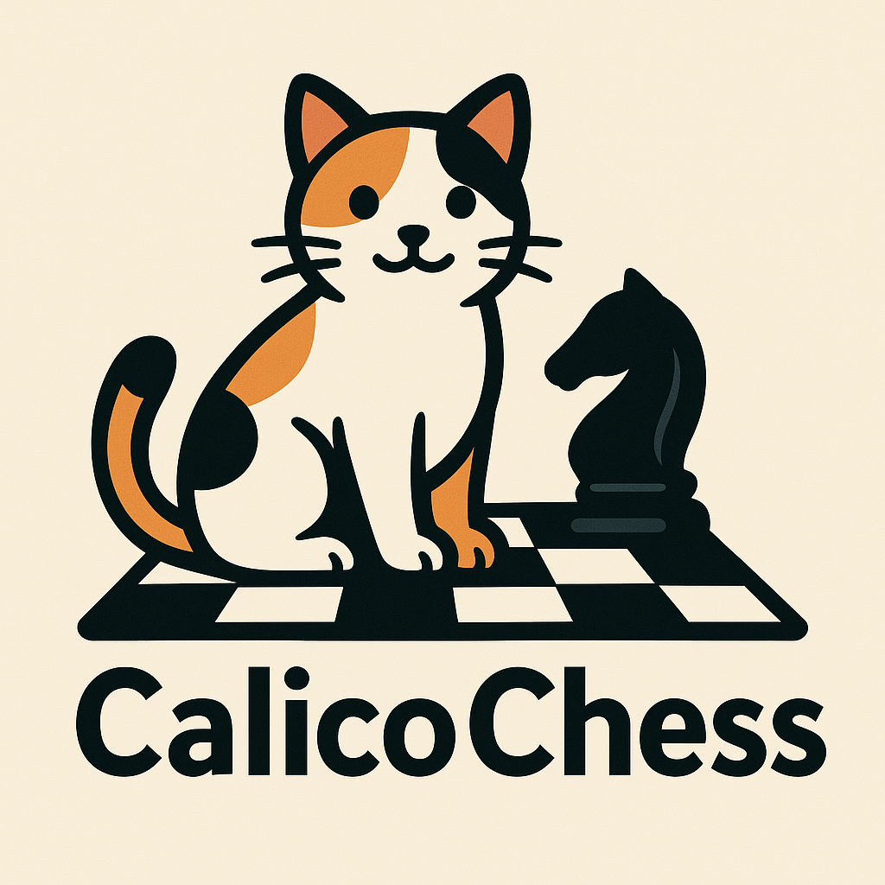

# Calico Chess
https://kodingforkittehs.github.io/CalicoChess/

Keeps the positions you like to play close by for easy study and review

## Features
- Tagging positions for easy organization
- Importing and exporting repertoires in PGN format
- Visual board interface for position review
- Cloud synchronization for access across devices

## Development

### Testing

This project uses comprehensive testing frameworks to prevent regressions:

#### Frontend Tests (Vitest + React Testing Library)
```bash
cd frontend
npm install
npm test              # Run tests
npm run test:ui       # Run tests with UI
npm run test:coverage # Run with coverage report
```

#### Backend Tests (pytest)
```bash
cd backend
pip install -r requirements.txt
pytest                     # Run all tests
pytest -v                  # Run with verbose output
pytest --cov=src          # Run with coverage report
```

### Running Tests Before Deployment

Before pushing changes or deploying:
1. Run frontend tests: `cd frontend && npm test`
2. Run backend tests: `cd backend && pytest`
3. Ensure all tests pass before committing
